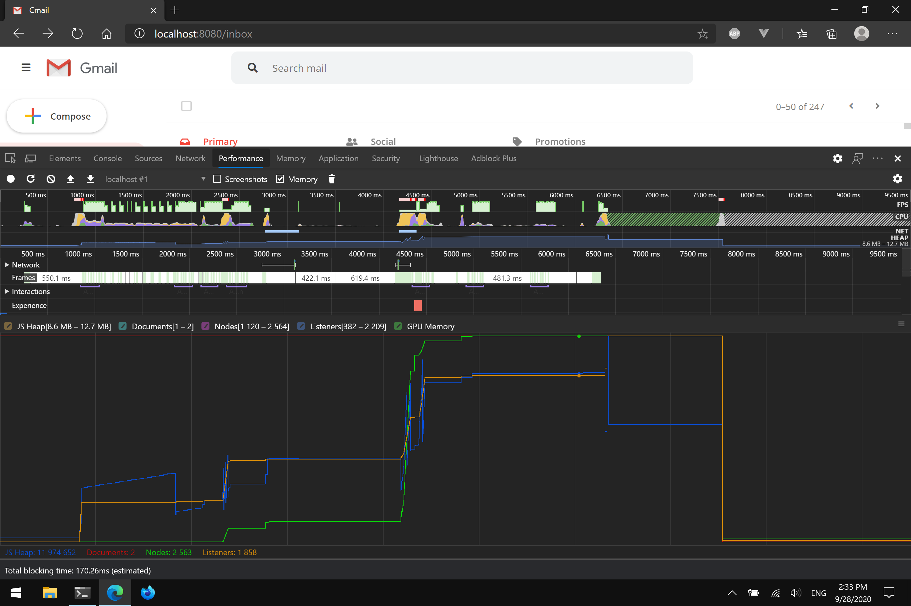
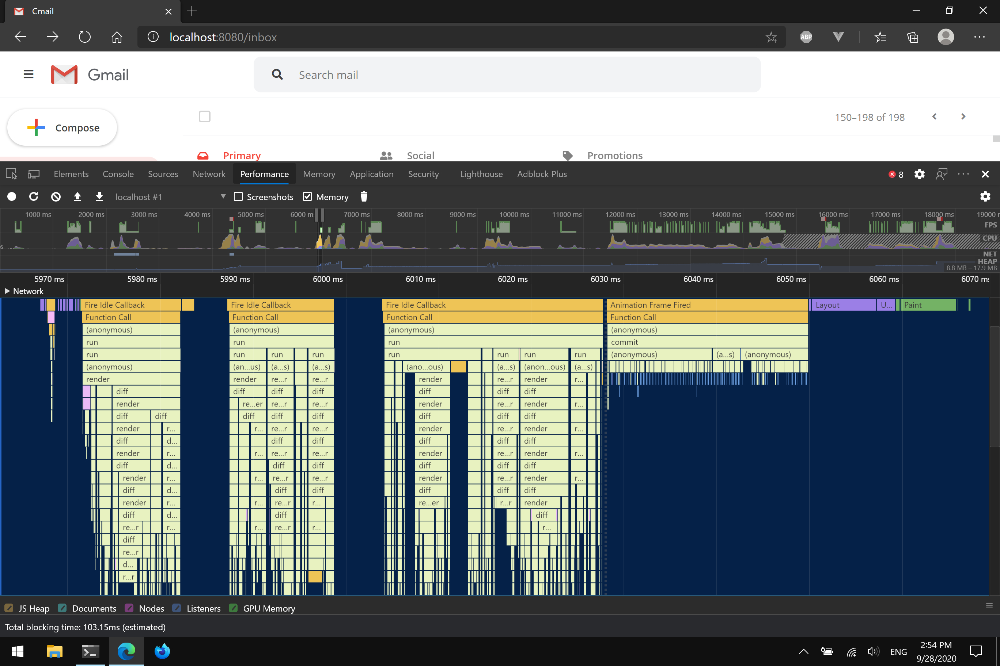

# Replay

## What's new (on dev branch)

### Goodbye Module Bundler, Goodbye Virtual DOM

I deleted webpack and wrote a tool to serve individual ES modules (anything with a transform) with live reload.

JSX now compiles to instructions that perform the diff directly, rather than creating vDOM nodes to be diffed by another procedure.

```js
__STEP_INTO__(ListItem, {
  selected: selected,
  draggable: canDelete,
  onclick: onclick,
  ondragstart: ondragstart,
  ondrag: ondrag,
  ondragend: ondragend,
});

__CONTENT__(() =>
  canDelete
    ? __STEP_OVER__(_Checkbox__WEBPACK_IMPORTED_MODULE_1__["default"], {
        checked: selected,
        onchange: toggleItem,
      })
    : __STEP_OVER__("comment", {})
);

__CONTENT__(
  () => (
    __STEP_INTO__(SenderInfo, {}),
    __CONTENT__(() => senderInfo),
    __STEP_OUT__(SenderInfo)
  )
);

__CONTENT__(
  () => (
    __STEP_INTO__(Summary, {}),
    __CONTENT__(
      () => (
        __STEP_INTO__(Title, {}), __CONTENT__(() => title), __STEP_OUT__(Title)
      )
    ),
    __CONTENT__(() =>
      __STEP_OVER__(Preheader, {
        innerHTML: preheaderHtml,
      })
    ),
    __STEP_OUT__(Summary)
  )
);

__CONTENT__(() =>
  canDelete
    ? (__STEP_INTO__(Actions, {}),
      __CONTENT__(() =>
        __STEP_OVER__(_IconButton__WEBPACK_IMPORTED_MODULE_2__["default"], {
          type: "trash",
          onclick: Object(replay_utils__WEBPACK_IMPORTED_MODULE_0__["stop"])(
            deleteItem
          ),
        })
      ),
      __STEP_OUT__(Actions))
    : __STEP_OVER__("comment", {})
);

__STEP_OUT__(ListItem);
```

This seems to have solved the memory leak?



This project is highly inspired by React and MobX.

The basic idea is that rendering is a compilation process consisting of expanding macros (templates) into code (description of the DOM) and then translating it into DOM operations (add/remove/update). The component instances caches the parameters (props and state) used in its evaluation and so that this process could be rolled back and start again from those points, erasing previous effects that are invalidated and reusing completed work whenever possible.

Dependencies form a directed graph where stored properties are the sources, computed properties are internal nodes, and component instances are the sinks. Each path on this graph coincides with the state of the actual call stack at some point during the evaluation. Mutations invalidate all previous computations (represented by nodes) reachable from the affected source. This recursive dependency tracking and invalidation mechanism is implemented using the observer pattern with an additional observer stack. The subscriptions need only be one-time (analagous to long-polling), because the observers are not actually observing for incoming data, but rather invalidation of their own cached value.

## Demo Project



