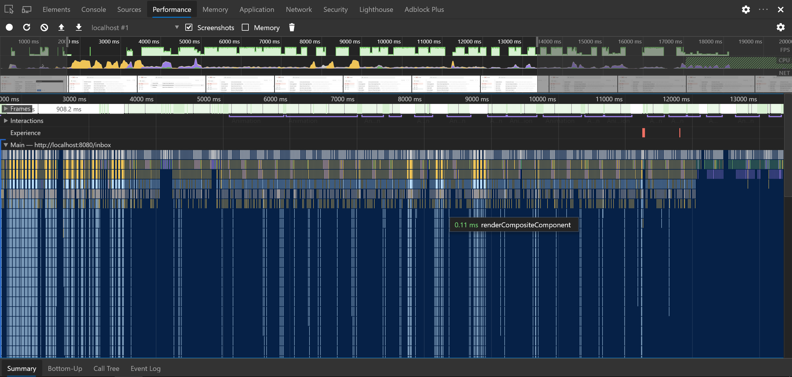

# Replay

This project is highly inspired by React and Vue.

The basic idea is to express UI as a composition (evaluated in normal order, i.e. from the outside in, as opposed to applicative order) of pure functions that can be repeatedly invalidated, rolled back and re-evaluated - hence the name replay The component instances are the (virtual) stack frames that store information such as input arguments (props) and local variables (state) for all render function invocations.

Dependencies can be modeled as a directed graph where stored properties are the sources, component instances are the sinks, and computed properties are internal nodse. Each path ending up on a component instance corresponds to the state of the (actual) call stack (in reverse) at some point during its render. Reactivity is implemented by applying the obserer pattern transitively (recursively) based on the directed dependency graph. The subscriptions only need to be one-time (think long-polling), i.e. the observers don't care about future _data_ but for _invalidation_ of previous data, and this only needs to happen once. Once it the new value is obtained, a new subscription would be made again for future invalidations.

## Demo Project


#### Render phase (idle callbacks) and commit phase (animation frame)


#### Interleaving of long-running render tasks and hover events



### Supports async components


One could easily simulate normal-order evaluation with quoting, i.e. in Clojure:

```clojure
(defn name-box [name]
  {:font-weight "bold" :label-content name})

(defn fancy-box [children]
  {:border-style "1px solid blue" :children children})

(defn user-box [user]
  (let [name (str (get user :first-name) " " (get user :last-name))]
    `(fancy-box ["Name: "
                 `(name-box ~~name)])))

(defn render [comp]
  (if (seq? comp)
    ; functional component
    (render (eval comp))
    (if (map? comp)
      ; host component
      (if (contains? comp :children)
        (let [children (get comp :children)
              rendered (if (vector? children)
                         (map render children) (render children))]
          (assoc comp :children rendered))
        comp)
      comp)))

(let [user {:first-name "Wenqi" :last-name "He"}]
  (render (user-box user)))

;;  Output:
;;  {
;;    :border-style "1px solid blue",
;;    :children (
;;      "Name: "
;;      {
;;        :font-weight "bold",
;;        :label-content "Wenqi He"
;;      }
;;    )
;;  }
```
