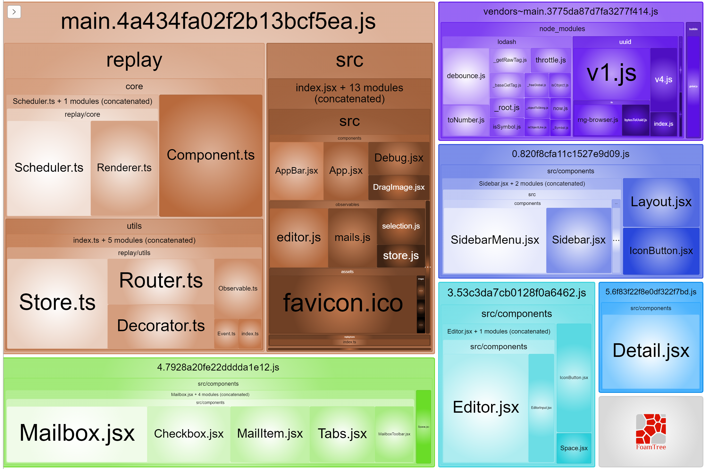

# Replay

This project is highly inspired by React.

The basic idea is that UI can be expressed as a composition of _pure_ render functions that gets re-evaluated (in normal order, i.e. from the outside in, as opposed to applicative order in most programming languages) whenever relevant state changes, as opposed to instances that actively manage their internal states. The instances that are created are in fact the activation records (i.e. stack frames) that store information such as input arguments and local variables for each invocation of a render function.

The signature for such render functions differs slightly from React:

```js
function SomeComponent(props, scope, context) {
  context.emit(() => {
    /* Some side effect */
  });
  return (
    <AnotherComponent someProp={scope.someVariableFromWayAbove}>
      <SomeChild onclick={() => this.forceUpdate()} />
      <SomeOtherChild {...moreProps} />
    </AnotherComponent>
  );
}
SomeComponent.init = (props, scope) => {
  scope.a = "this lives in the dynamic scope";
  return {
    b: "this will be added to the scope too",
  };
};
```

One could easily simulate normal-order evaluation with quoting, i.e. in Clojure:

```clojure
(defn name-box [name]
  {:font-weight "bold" :label-content name})

(defn fancy-box [children]
  {:border-style "1px solid blue" :children children})

(defn user-box [user]
  (let [name (str (get user :first-name) " " (get user :last-name))]
    `(fancy-box ["Name: "
                 `(name-box ~~name)])))

(defn render [comp]
  (if (seq? comp)
    ; functional component
    (render (eval comp))
    (if (map? comp)
      ; host component
      (if (contains? comp :children)
        (let [children (get comp :children)
              rendered (if (vector? children)
                         (map render children) (render children))]
          (assoc comp :children rendered))
        comp)
      comp)))

(let [user {:first-name "Wenqi" :last-name "He"}]
  (render (user-box user)))

;;  Output:
;;  {
;;    :border-style "1px solid blue",
;;    :children (
;;      "Name: "
;;      {
;;        :font-weight "bold",
;;        :label-content "Wenqi He"
;;      }
;;    )
;;  }
```

## Auxiliary Modules

### Observable + Observer

The idea of using the observer pattern for reactivity is taken from Vue, but opt-in reactivity system that the router and state containers depend on.

```js

```

The `observable` function takes an object and returns a proxy with a `get` trap that registers the stack frame of the component functions that's currently running as a dependent (observer) of the property being accessed, and a `set` trap that schedules a re-render (re-evaluation) starting from that stack frame when the property value changes.

### Decorator

```js
const ColorfulComponent = $$(MyComponent)`
  background: red;
`.and`::after {
  content: '';
  color: blue;
}`;
```

For DOM components you can simply use object property syntax. The following are (almost) equivalent:

```js
const BlackButton1 = $$.button`background: black`;
const BlackButton2 = $$('button')`background: black`;
const BlackButton3 = $$(getHostRenderFunction('button'))`background: black'
```

which is (almost) equivalent to

````

This is inspired by styled-components. The name refers to the fact it "decorates" the component both in the sense that it creates a higher-order function that enhances the wrapped
component function, and in the sense that it applies styles to the wrapped component.

## Implementation Details: Scheduling

### Batched Updates

The setters of `observable`'s do not trigger re-renders synchronously. Instead, it addes all observing instances to a "update queue" that will be flushed _at the end of current event loop tick/iteration (i.e. after current task/macrotask)_. This is implemented using `queueMicrotask`. The update queue is implemented using a `Set` so that each instance will only be added once no matter how many of its dependencies have changed or how many times those dependencies have changed.

### Priority Queue

All render requests submitted are handled by the `scheduler` module, which queues pending tasks in a _priority queue based on node depth_ &mdash; specifically, the ones closer to the root are always rendered first. This was designed to prevent the following scenario: Imagine a component uses a dynamic variable `a` declared by an ancestor, and it also takes an argument `b`, which is derived from `a`, from its parent. Now if `a` is updated and the child is updated before its parent, it will use the latest value of `a` but a value of `b` that's computed from the original value of `a` &mdash; this would be an error.

### Generators and Effects

Another important design choice is that all functions involved in the rendering process, whether the library's internal functions, or user-defined component functions, should not perform side effects (e.g. DOM updates) themselves. Instead, all side effects need to be delegated to the scheduler. This is implemented by using _generators_ in place of functions with side effects. The scheduler runs a loop that drives these generators, which `yield` their side effects as _thunks_. For example, inside the wrapper component created by `decor`:

```js
const decor = (component) => (...args) => {
  // ...
  const StyleWrapper = function* (props) {
    if (!classCache.has(computedDeclarations)) {
      // ...
      yield () => addCSSRule(rule);
    }
    // ...
  };
  // ...
};
````

The scheduler can decide what to do with those thunks. For example, it could execute them synchronously, or it could add them to a _effect list_ to be commited later.

### Cooperative Scheduling

Using generators also allows for asynchronous rendering &mdash; which means that long-running render tasks could be split into chunks and spread across multiple frames &mdash; using the [Cooperative Scheduling of Background Tasks API](https://www.w3.org/TR/requestidlecallback/) (i.e. [`window.requestIdleCallback`](https://developer.mozilla.org/en-US/docs/Web/API/Window/requestAnimationFrame)) and batching DOM updates using [`window.requestAnimationFrame`](https://developer.mozilla.org/en-US/docs/Web/API/Window/requestAnimationFrame). My implementation is as follows:

## Demo Project




### Performance

#### Render phase (idle callbacks) and commit phase (animation frame)


#### Interleaving of long-running render tasks and hover events


